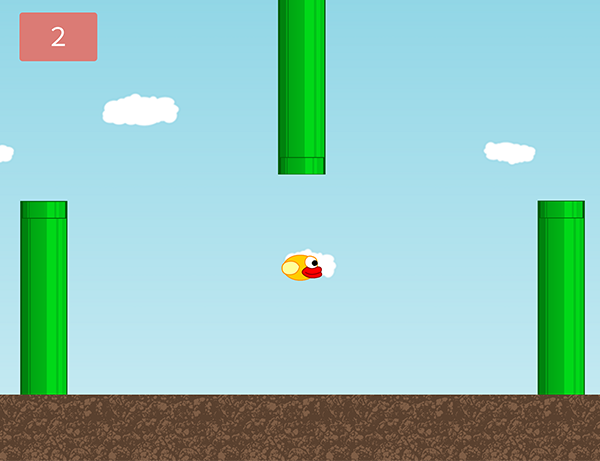

# Bird Strike
 
## Overview
Objective: Fly around while avoiding incoming pipes!

<a href="http://amituuush.github.io/lyst/public/">Click here</a> for a demo.

## Technical
• The app is built in JavaScript on HTML canvas 
• Gulp is used as a build system 
• User high scores are stored using local storage 

  

  
## Challenges
One of the biggest challenges of this project was building the physics and collision components as I had to refresh my memory on several geometry concepts. For example, when calculating whether a collision is made between a bird and a pipe, I only knew the x and y coordinates, and sizes of the bird and pipe. Using this information I could calculate the distance between the center of the circle and the closest point of the pipe to the circle using Pythagorean theorem. I'd then compare this to radius to determine whether. If the radius is greater than the distance between the center of the circle and the closest point of the pipe, then a collision has occurred. Otherwise, no collision.
 

  
## Development Roadmap
Future developments of the app will include: 
• Ability to choose bird color 
• Implement different difficulty levels of the game, with more difficult levels having pipes that move faster.
• Different backgrounds and obstacles
 
• Make app responsive and function on smartphones  
• Have background slowly move to make bird appear as if it were traveling through space 
• Display user's last 5 scores in addition to high score 
